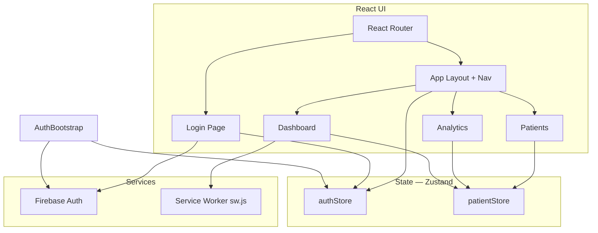

# RAGA Healthcare SaaS UI

B2B healthcare SaaS frontend built for the RAGA.AI Frontend Developer Assignment: React, TypeScript, Firebase Authentication, Zustand, patient management (grid/list), analytics, and a service worker for notifications.

## Architecture

High-level view of how the app is structured and how data flows.



### UI layer — React + TypeScript

| Piece | Role |
| ----- | ---- |
| **React 19** | Components, hooks, and page-level UI. |
| **TypeScript** | Types for patients, props, and env (`src/types`, `vite-env.d.ts`). |
| **Vite** | Dev server, production build, and bundling. |

**Entry:** `main.tsx` mounts the root, loads global styles, and registers the **service worker** (`public/sw.js`).

**Root app:** `App.tsx` wraps the tree in `BrowserRouter`, runs **`AuthBootstrap`** (listens to Firebase auth), and renders **`AppRoutes`**.

### Routing — React Router

| Route | Access | What it shows |
| ----- | ------ | ---------------- |
| `/login` | Public (guests only when already signed out) | Email/password sign-in. |
| `/` | Protected | **Dashboard** — metrics from patient data + notification demo. |
| `/analytics` | Protected | **Analytics** — status distribution from the same patient list. |
| `/patients` | Protected | **Patient directory** — grid/list toggle. |

**`AppRoutes.tsx`** defines `GuestRoute` (redirect to `/` if logged in) and `ProtectedRoute` (redirect to `/login` if not). **`AppLayout.tsx`** is the sidebar shell for all protected pages (`Outlet`).

### State management — Zustand

Global client state lives in small focused stores (no Redux). Components subscribe with hooks; no prop drilling for auth or patients.

| Store | File | Responsibility |
| ----- | ---- | ---------------- |
| **Auth** | `src/store/authStore.ts` | Current user (`uid`, `email`), `initialized` flag. Updated by `AuthBootstrap` via Firebase `onAuthStateChanged`. Login/sign-out flows write through Firebase; the listener keeps the store in sync. |
| **Patients** | `src/store/patientStore.ts` | Demo **patient list**, **grid vs list** `viewMode`. Dashboard and Analytics derive metrics from this list; Patients page reads the same data and toggles layout. |

### Authentication — Firebase

| Piece | Role |
| ----- | ---- |
| **`src/lib/firebase.ts`** | Reads `VITE_*` env vars, initializes the Firebase app and returns `getAuth()` when configured. |
| **`AuthBootstrap.tsx`** | Subscribes once to `onAuthStateChanged` and updates `authStore`. |
| **`LoginPage.tsx`** | Validates input, calls `signInWithEmailAndPassword`, surfaces Firebase errors. |
| **`AppLayout.tsx`** | **Sign out** via `signOut(auth)`. |

If Firebase env vars are missing, the app still boots; the login screen shows a configuration warning.

### Feature modules

| Area | Location | Notes |
| ---- | -------- | ----- |
| Patients UI | `src/features/patients/components/` | `PatientCard`, `ViewModeToggle`, `StatusBadge` — reusable presentation. |
| Layout / brand | `src/components/` | `AppLayout`, `BrandLogo`. |
| Notifications | `src/lib/localNotification.ts` | Asks permission, posts a message to the active service worker to `showNotification`. |

### Service worker

- **`public/sw.js`** — install/activate handlers and a `message` handler that shows a **local** notification (not FCM server push).
- **`main.tsx`** registers the worker after load.
- **Dashboard** — “Simulate care team alert” exercises this path.

---

## Tech stack (summary)

- **React 19** + **TypeScript** + **Vite**
- **Firebase Authentication** (email/password)
- **Zustand** (global state — auth + patients)
- **React Router** (routing, protected routes)

## Project layout

```
src/
  app/           # AppRoutes, AuthBootstrap
  components/    # Layout, BrandLogo
  features/      # Feature-scoped UI (e.g. patients)
  lib/           # firebase, localNotification
  pages/         # Login, Dashboard, Analytics, Patients
  store/         # Zustand stores
  types/         # Shared TS types
public/
  sw.js          # Service worker
```

## Setup

```bash
npm install
```

Create a **`.env`** file in the project root with your Firebase web config (variable names must be prefixed with `VITE_`):

- `VITE_FIREBASE_API_KEY`
- `VITE_FIREBASE_AUTH_DOMAIN`
- `VITE_FIREBASE_PROJECT_ID`
- `VITE_FIREBASE_STORAGE_BUCKET`
- `VITE_FIREBASE_MESSAGING_SENDER_ID`
- `VITE_FIREBASE_APP_ID`

Enable **Email/Password** in the Firebase console under Authentication → Sign-in method.

```bash
npm run dev
```

Restart the dev server after changing `.env`.

## Scripts

| Command   | Description        |
| --------- | ------------------ |
| `npm run dev` | Start dev server |
| `npm run build` | Production build |
| `npm run preview` | Preview production build |

## Service worker and notifications

The app registers `public/sw.js`. On the **Dashboard**, use **Simulate care team alert** to request notification permission and show a **local** notification via the service worker (suitable for the assignment demo). Use a secure context (`https://` or `http://localhost`).

## Deploy on Vercel

The repo includes **`vercel.json`** so client-side routes (e.g. `/patients`) work on refresh.

### 1. Push your code to GitHub

Vercel deploys from Git. Ensure the latest `main` (or your branch) is on GitHub.

### 2. Import the project in Vercel

1. Go to [vercel.com](https://vercel.com) and sign in (e.g. with GitHub).
2. **Add New…** → **Project**.
3. **Import** the repository that contains this app (`raga-healthcare-saas-ui` or your repo name).

### 3. Configure the project

If the **Vite app is at the repository root** (this folder is the repo root):

- **Framework Preset:** Vite (auto-detected), or **Other** if you rely only on `vercel.json`.
- **Root Directory:** leave default `.`  
- **Build Command:** must be **`npm run build`** (runs `tsc` + local `vite`). Do **not** use `vite build` alone — that causes **exit 127** (`vite: command not found`) on Vercel because `vite` is not on the global PATH.
- **Output Directory:** `dist`

If your GitHub repo is the parent folder and this app lives in a subfolder:

- Open **Root Directory** → **Edit** → select the `healthcare-saas` folder (or the folder that contains `package.json`).

### 4. Add environment variables

Before the first deploy (or under **Settings → Environment Variables**):

Add the same Firebase keys you use locally, for **Production** (and **Preview** if you want preview deployments to work):

| Name | Value |
| ---- | ----- |
| `VITE_FIREBASE_API_KEY` | from Firebase console |
| `VITE_FIREBASE_AUTH_DOMAIN` | … |
| `VITE_FIREBASE_PROJECT_ID` | … |
| `VITE_FIREBASE_STORAGE_BUCKET` | … |
| `VITE_FIREBASE_MESSAGING_SENDER_ID` | … |
| `VITE_FIREBASE_APP_ID` | … |

Redeploy after changing env vars (**Deployments** → ⋮ → **Redeploy**).

### 5. Deploy

Click **Deploy**. When it finishes, open the **`.vercel.app`** URL.

### 6. Firebase authorized domain

1. Firebase Console → **Authentication** → **Settings** → **Authorized domains**.
2. **Add domain** → enter your Vercel hostname (e.g. `your-project.vercel.app` and any custom domain you add later).

Without this, sign-in can fail on the live site.

### 7. Optional: verify build locally

```bash
npm run build
npm run preview
```

Visit the preview URL and click through `/login`, `/patients`, etc.

## Git workflow (feature branches)

Work is split across branches (e.g. `chore/project-scaffold`, `feat/app-shell-routing-zustand`, `feat/firebase-authentication`, `feat/dashboard-analytics-patients`, `feat/service-worker-notifications`). Merge them into `main` in order when you are ready.

## License

Private — assignment submission.
